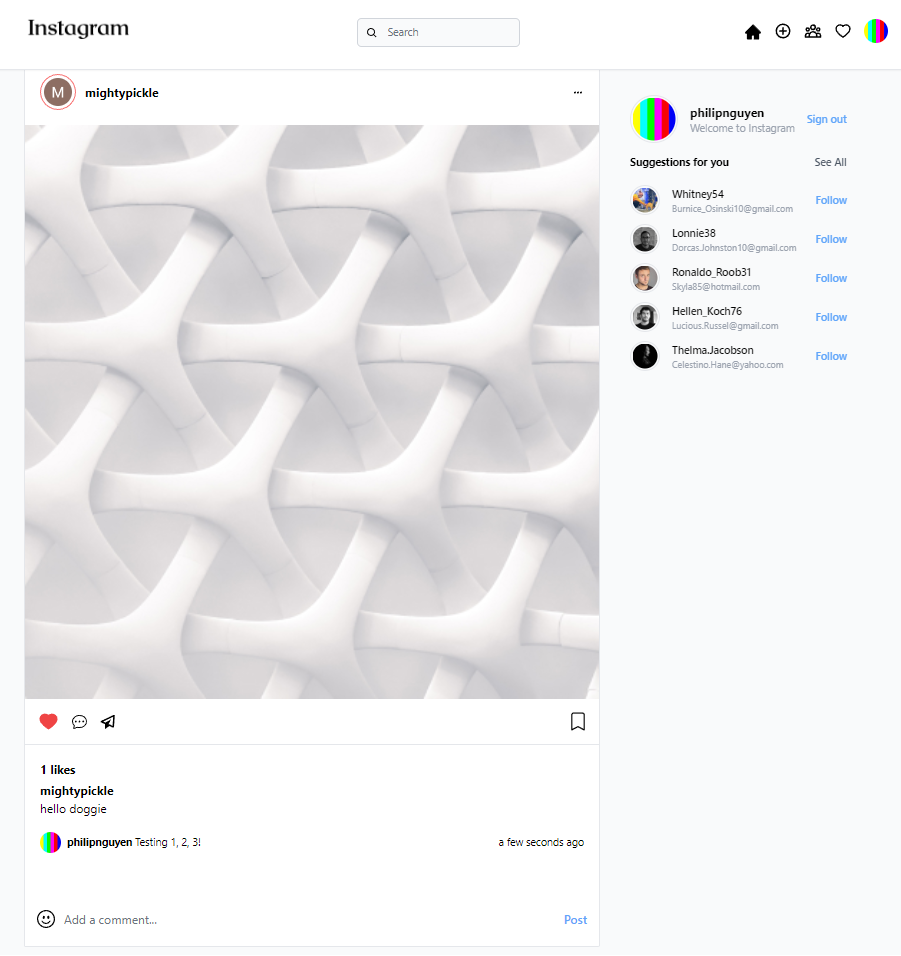

# igclone

This igclone app was intended to mimic the appearance and functionalities of the popular social media app, Instagram.

## Technologies used

- NextJS / React
- MongoDB / Mongoose

In this project, I used NextJS to build out the front-end and back-end.

---

## Features

As it stands, these are the main features of my igclone web app.

- Google Authentication / Login / Log-out
- Creating a post
- Likes on the post
- Comments on the post
